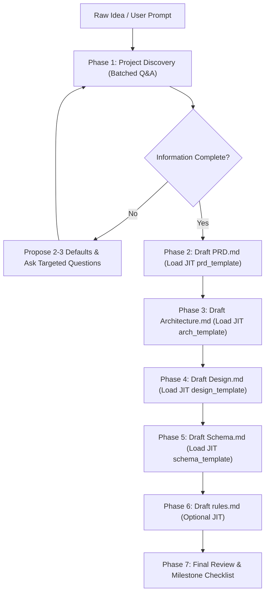

# Pre-Development Research & Specification Skill (`pra-dev-research`)

This skill transforms raw ideas and rough concepts into comprehensive, production-ready specification documents that serve as an authoritative guide for development.

---

## Core Principles

1. **Interactive Discovery Loop & Turn Compression**: 
   - Never generate all documents in a single unvetted dump. 
   - **Token Optimization Rule**: To prevent $O(N^2)$ conversation turn bloating, batch questions (max 3–4 high-impact questions per turn) and **always provide recommended defaults**. This allows the user to reply with a quick *"Approve defaults"* or adjust single points in 1–2 turns instead of 8.
2. **Just-In-Time (JIT) Progressive Disclosure**:
   - **Strict Token Rule**: **NEVER** view or load all reference templates at once. Load **ONLY** the single template file needed for the active phase (`prd_template.md` during Phase 2, `architecture_template.md` during Phase 3, etc.) and discard prior templates from attention.
3. **Code-Block Minimization**:
   - **Strict Rule**: Avoid writing raw application code blocks.
   - **Replacement**: Represent logic using Mermaid diagrams (flowcharts, sequence diagrams, class diagrams), high-level workflows, and structured pseudocode.
   - **Exceptions**: Raw code is permitted **ONLY** when strictly necessary for essential API contract interfaces (e.g., TypeScript interfaces/OpenAPI endpoints) or database SQL definitions (`CREATE TABLE ...`).
4. **Autonomous Web Research (Snippets First)**:
   - Use `search_web`, `read_url_content`, or browser tools (`agent-browser` / `/browser`) with targeted keywords. Extract only relevant snippets/version numbers to prevent context flooding.
5. **Industry-Standard Depth & Single-Source-of-Truth**: 
   - Ensure every specification document includes actionable details that eliminate ambiguity.
   - Always prioritize editing existing target documents (`PRD.md`, `Architecture.md`, `Design.md`, `Schema.md`, `rules.md`) in-place rather than creating new file variants.

---

## Workflow & Phases



---

### Phase 1: Project Discovery & Turn Compression Protocol

1. **Identify the Core Vision**:
   - What problem does the product solve? Who is the target user?
   - What is the primary value proposition? Target platform (Web, Mobile, Desktop, CLI, API)?
2. **Batched Recommendation Protocol (Token Efficient)**:
   - Instead of open-ended conversational questions, present 3–4 structured questions with **pre-formulated recommended options**:
     - *Question 1 (Platform & Target Audience)*: [Proposed Default: Modern Web App (Next.js/React) for B2B Users]
     - *Question 2 (Core MVP Feature Boundary)*: [Proposed Default: Auth, Dashboard, Core Workspace, Data Export]
     - *Question 3 (Data & Scaling Need)*: [Proposed Default: PostgreSQL with Row-Level Security]
   - Ask the user: *"You can approve these defaults directly with 'Approve defaults', or customize any specific item."*

---

### Phase 2 to 6: Document Generation (JIT Progressive Disclosure)

When drafting each document, read **ONLY** the single respective template right before authoring:

| Document | Purpose | Reference Template (Read JIT Only) |
| :--- | :--- | :--- |
| **`PRD.md`** | Scope, MVP, goals, user personas, functional & non-functional requirements, KPIs. | `references/prd_template.md` |
| **`Architecture.md`** | Tech stack, system components, folder layout, data flows, integration contracts. | `references/architecture_template.md` |
| **`Design.md`** | UI/UX workflows, design tokens, component architecture, state management. | `references/design_template.md` |
| **`Schema.md`** | Entity relationships, data models, constraints, indexes, migrations. | `references/schema_template.md` |
| **`rules.md`** *(Optional)* | Coding guidelines, linting rules, architectural constraints for AI/human contributors. | `references/rules_template.md` |

---

### Writing & Formatting Guidelines

- **Use Mermaid for Visual Clarity**:
  - State machines for complex lifecycle states (`stateDiagram-v2`).
  - Sequence diagrams for API / service communication (`sequenceDiagram`).
  - Flowcharts for user decision trees (`flowchart TD` / `flowchart LR`).
  - Entity-Relationship diagrams for database models (`erDiagram`).
- **Structured Pseudocode**:
  Use typed, language-agnostic pseudocode when describing algorithms or business logic.
- **Language**: Write all specification files and documentation in clear, professional English.

---

### Document Mutation & In-Place Merging Protocol (Token-Optimal)

1. **Target Existing Files First**: Always check if `PRD.md`, `Architecture.md`, `Design.md`, `Schema.md`, or `rules.md` already exist. Edit these files directly.
2. **Selective Section Updating**:
   - When the user asks for a modification, replace **only the target markdown section** (e.g. update just Section 2 in `Architecture.md`) instead of re-emitting the entire document.
   - Intelligently preserve all existing context, constraints, and valid specs.
3. **Clean Appending for New Features**:
   - When the user introduces an entirely new capability, append a clean extension section at the bottom of the relevant document:
     ```markdown
     ---

     ## Feature Extension: [New Feature Name]
     - **Context & Motivation**: ...
     - **Specification Details**: ...
     ```
