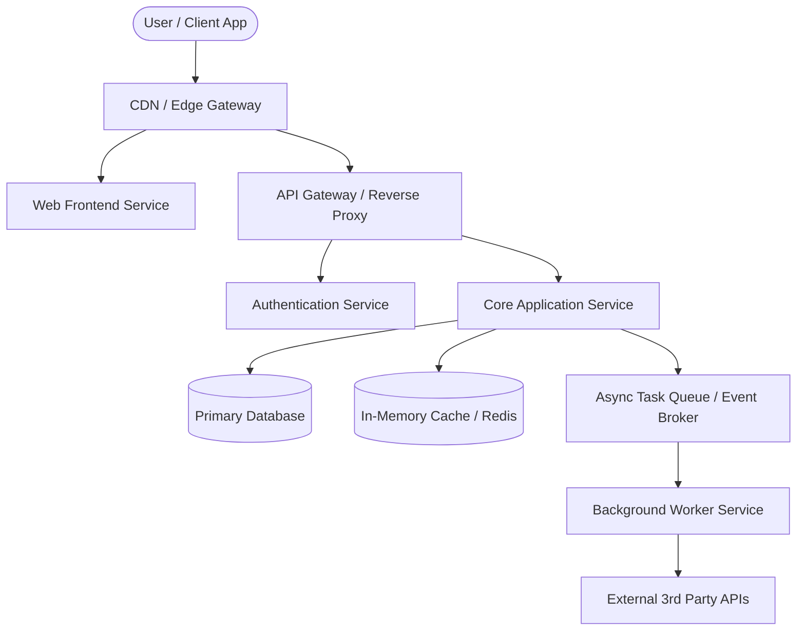
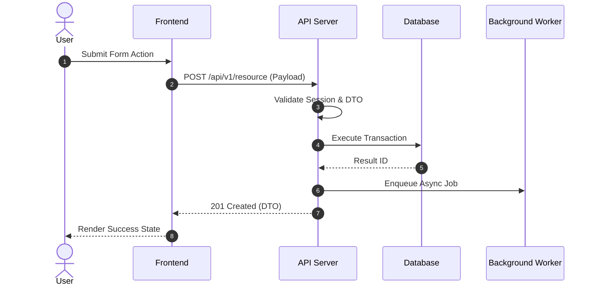

# System Architecture Template
<!-- Load JIT only when authoring or updating Architecture.md -->

```markdown
# System Architecture Document

## 1. High-Level System Overview
Concise architectural pattern summary (Modular Monolith, Event-Driven, Jamstack, Serverless).

### System Context Diagram


---

## 2. Tech Stack Selection & Architectural Rationale

| Layer | Technology | Version | Rationale & Trade-offs |
| :--- | :--- | :--- | :--- |
| **Frontend** | [e.g. Next.js/React] | LTS | Fast initial load, SEO, server components |
| **Backend** | [e.g. Node/FastAPI/Go] | LTS | Concurrency, type safety, rich ecosystem |
| **Database** | [e.g. PostgreSQL] | v16+ | ACID compliance, JSONB, relational integrity |
| **Cache/Queue**| [e.g. Redis/BullMQ] | Latest | Fast in-memory state, async background jobs |
| **Auth** | [e.g. Supabase/Auth.js] | Latest | Standards-compliant sessions, OAuth2 |
| **Deploy/CI** | [e.g. Vercel/Docker] | - | Automated builds, scalable edge routing |

---

## 3. Project Directory Layout

```text
project-root/
├── apps/
│   ├── web/                     # Frontend client app
│   └── api/                     # Backend API service
├── packages/
│   ├── db/                      # Schemas, migrations & client
│   └── types/                   # Shared DTOs & interfaces
└── docs/                        # Specifications & Architecture
```

---

## 4. Key Workflows & Sequence Flows



---

## 5. Shared API Contracts (Type-Only Minimal Exception)
```typescript
export interface ApiResponse<T> {
  success: boolean;
  data?: T;
  error?: { code: string; message: string; details?: unknown };
}
```

---

## 6. Security, Resilience & Scalability
- **Auth & RBAC**: Token lifecycle, refresh rotation, role-based guardrails.
- **Rate Limiting**: IP/user token bucket algorithms at edge.
- **Data Protection**: TLS 1.3 transit, AES-256 rest, Argon2id password hashing.

---

## 7. Architecture Revision History & System Addendums

### In-Place Modifications:
| Date | Layer / Section | Summary of Update | Reason |
| :--- | :--- | :--- | :--- |
| [YYYY-MM-DD] | [Layer] | [Update details] | [Context] |

### Appended System Addendums:
---

## Architectural Addendum: [Subsystem Name]
- **Purpose**: [Role in ecosystem]
- **Contracts & Integration**: [APIs/Events used]
- **Deployment**: [Runtime host]
```
