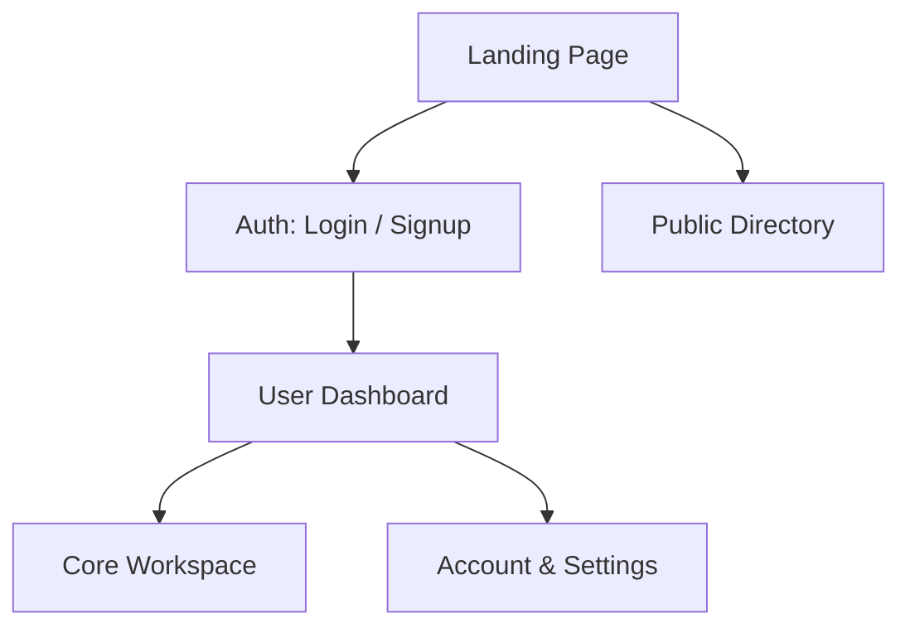
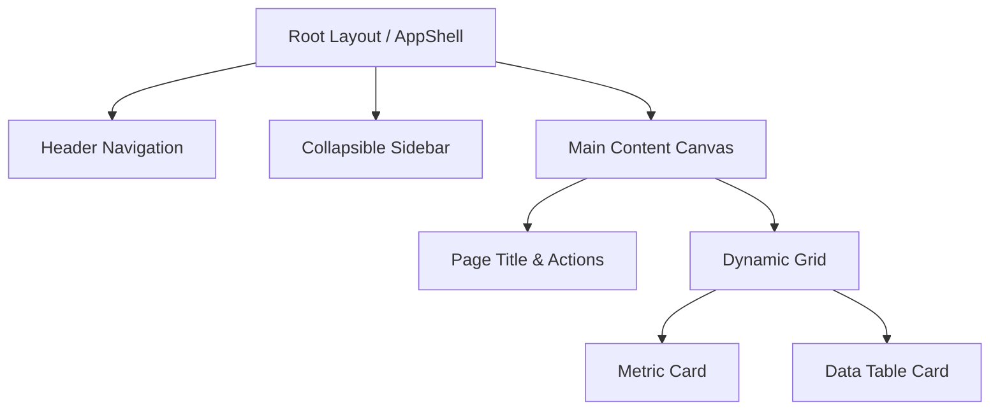

# Design System & UI/UX Specification Template
<!-- Load JIT only when authoring or updating Design.md -->

```markdown
# Design & UI/UX Specification Document

## 1. UX Flow & Sitemap



---

## 2. Design System Tokens

### 2.1 Colors & Semantic Tokens
- **Backgrounds**: Base `#0B0F17` | Card `#151C28` | Hover `#1E293B`
- **Text**: Primary `#F8FAFC` (High contrast) | Muted `#94A3B8` | Border `#334155`
- **Status**: Brand Accent `#3B82F6` | Success `#10B981` | Warning `#F59E0B` | Error `#EF4444`

### 2.2 Typography Scale
| Token | Size / Line-Height | Weight | Tracking | Usage |
| :--- | :--- | :--- | :--- | :--- |
| `text-display` | 36px / 44px | Bold (700) | -0.02em | Hero headline |
| `text-h1` | 28px / 36px | SemiBold (600) | -0.015em | Page headers |
| `text-h2` | 20px / 28px | SemiBold (600) | -0.01em | Section headers |
| `text-body` | 15px / 24px | Regular (400) | 0em | Primary content |
| `text-sm` | 13px / 18px | Medium (500) | +0.01em | Badges, metadata |

### 2.3 Spacing & Radius
- **Grid Scale**: 4px / 8px (`4px`, `8px`, `12px`, `16px`, `24px`, `32px`, `48px`).
- **Radii**: Badges `6px` | Inputs/Buttons `8px` | Cards/Modals `12px`-`16px`.

---

## 3. Component Hierarchy



---

## 4. Interaction States & Breakpoints
- **Interactions**: Button default -> hover (+5% lightness) -> active (scale 0.98). Empty states include icon, explanation & CTA. Field-level inline errors with aria-invalid.
- **Breakpoints**: Mobile `<640px` (single column) | Tablet `640-1024px` (2-column) | Desktop `>1024px` (max 1440px container).

---

## 5. Design System Evolution & Extensions

### In-Place Revisions:
| Date | Component / Section | Design Update | Rationale |
| :--- | :--- | :--- | :--- |
| [YYYY-MM-DD] | [Section] | [Update details] | [Context] |

### Appended Screen Extensions:
---

## Design Extension: [New Screen / Flow Name]
- **Goal & User Flow**: [Objective]
- **Component Layout**: [Key elements & hierarchy]
- **Micro-Interactions**: [Transitions / states]
```
