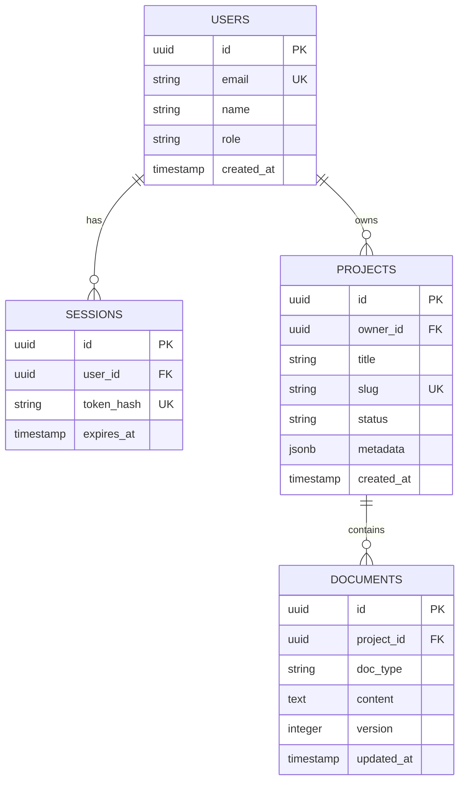

# Database Schema Specification Template
<!-- Load JIT only when authoring or updating Schema.md -->

```markdown
# Database Schema & Data Models Specification

## 1. Entity-Relationship Diagram (ERD)



---

## 2. Table Definitions

### 2.1 `users` Table
| Column Name | Data Type | Nullable | Default | Constraints |
| :--- | :--- | :--- | :--- | :--- |
| `id` | `UUID` | No | `gen_random_uuid()` | Primary Key |
| `email` | `VARCHAR(255)` | No | - | Unique, Case-insensitive |
| `password_hash` | `TEXT` | Yes | `NULL` | Nullable for OAuth |
| `role` | `VARCHAR(50)` | No | `'member'` | `'admin'`, `'member'` |
| `created_at` | `TIMESTAMPTZ` | No | `NOW()` | Audit timestamp |

### 2.2 `projects` Table
| Column Name | Data Type | Nullable | Default | Constraints |
| :--- | :--- | :--- | :--- | :--- |
| `id` | `UUID` | No | `gen_random_uuid()` | Primary Key |
| `owner_id` | `UUID` | No | - | FK -> `users(id)` ON DELETE CASCADE |
| `title` | `VARCHAR(200)`| No | - | Project display name |
| `slug` | `VARCHAR(220)`| No | - | Unique per owner |
| `status` | `VARCHAR(50)` | No | `'active'` | `'active'`, `'archived'` |
| `metadata` | `JSONB` | Yes | `'{}'` | Flexible settings |

---

## 3. Database Indexes & DDL

```sql
CREATE INDEX idx_users_email ON users(email);
CREATE INDEX idx_projects_owner_id ON projects(owner_id);
CREATE INDEX idx_documents_project_id_version ON documents(project_id, version DESC);
```

---

## 4. Integrity & Migration Strategy
- **Deletion Policy**: Hard delete vs Soft delete (`deleted_at`).
- **Migrations**: Tooling (Drizzle/Prisma/Flyway) and auto-triggers for `updated_at`.

---

## 5. Schema Evolution & Model Extensions

### In-Place Schema Updates:
| Date | Table / Entity | Alteration Details | Purpose |
| :--- | :--- | :--- | :--- |
| [YYYY-MM-DD] | `users` | [Added `is_verified` BOOLEAN] | [Email verification flow] |

### Appended Model Extensions:
---

## Schema Extension: [New Table / Domain]
- **Table Name**: `[table_name]`
- **Relationships**: [Foreign keys]
- **Fields**:
  | Column | Type | Nullable | Default | Description |
  | :--- | :--- | :--- | :--- | :--- |
  | `id` | `UUID` | No | `gen_random_uuid()` | Primary Key |
```
